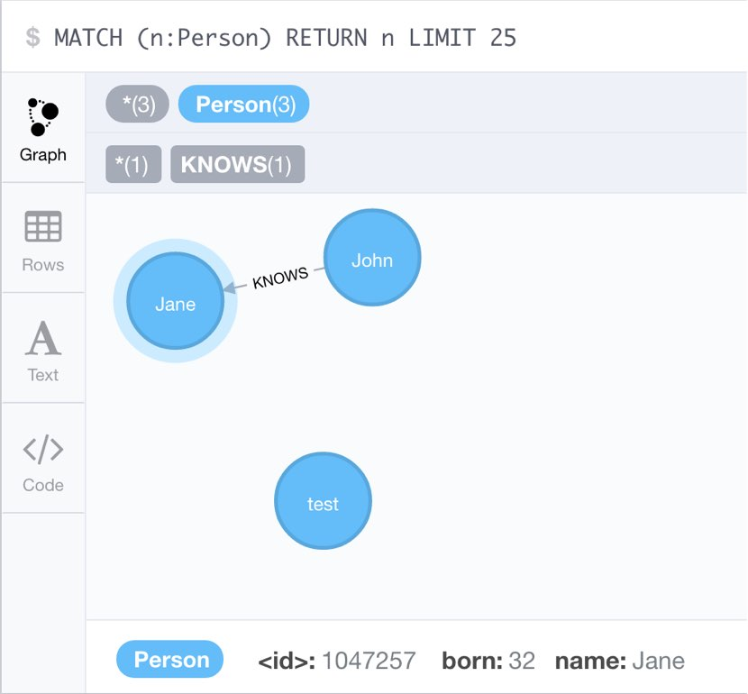

# Atomist 'spring-boot-neo4j-editors'

[](https://travis-ci.org/atomist-rugs/spring-boot-neo4j-editors)
[](https://join.atomist.com)

This [Rug][docs] archive has editors that add [Neo4j][neo4j] to
a [Spring Boot][boot] project.

[docs]: http://docs.atomist.com/
[neo4j]: https://neo4j.com/
[boot]: https://projects.spring.io/spring-boot/

## Rugs

### AddNeo

The AddNeo editor will add the required files and configuration to a
Spring Boot project so it can connect to a Neo4j database.  It also
adds a simple example model described below.

#### Prerequisites

Before running this Editor, you must have the following prerequisites
satisfied.

*   A Spring Boot project managed by [Maven][maven].

[maven]: https://maven.apache.org/

#### Parameters

This Editor has no parameters.

#### Running

Run it as follows:

```
$ cd to/your/spring/boot/repo
$ rug edit atomist-rugs:spring-boot-neo4j-editors:AddNeo
```

This will add the necessary files and configuration to your Spring
Boot project.  You can build and run the project in the standard
Spring Boot way.

```
$ ./mvnw spring-boot:run
```

It will also add tests that can be run.  By default, Spring Data Neo4j
connects to a local Neo4j server running on http://localhost:7474 You
**have to** configure your password in `application.properties`.

```
$ ./mvnw test
```

There is a single Person entity, which has `name` and `born`
properties and a `KNOWS` relationships that's mapped to a `friends`
field.  Person is exposed through 3 controller methods for listing,
creating people and for adding friends.



## Support

General support questions should be discussed in the `#support`
channel on our community slack team
at [atomist-community.slack.com][slack].

If you find a problem, please create an [issue][].

[issue]: https://github.com/atomist-rugs/spring-boot-neo4j-editors/issues

## Development

You can build, test, and install the project locally with
the [Rug CLI][cli].

[cli]: https://github.com/atomist/rug-cli

```sh
$ rug test
$ rug install
```

To create a new release of this project, simply push a tag of the form
`M.N.P` where `M`, `N`, and `P` are integers that form the next
appropriate [semantic version][semver] for release.  For example:

```sh
$ git tag -a 1.2.3
```

The Travis CI build (see badge at the top of this page) will
automatically create a GitHub release using the tag name for the
release and the comment provided on the annotated tag as the contents
of the release notes.  It will also automatically upload the needed
artifacts.

---
Created by [Atomist][atomist].
Need Help?  [Join our Slack team][slack].

[atomist]: https://www.atomist.com/
[slack]: https://join.atomist.com/
